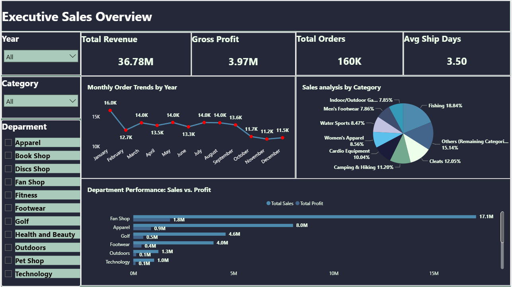
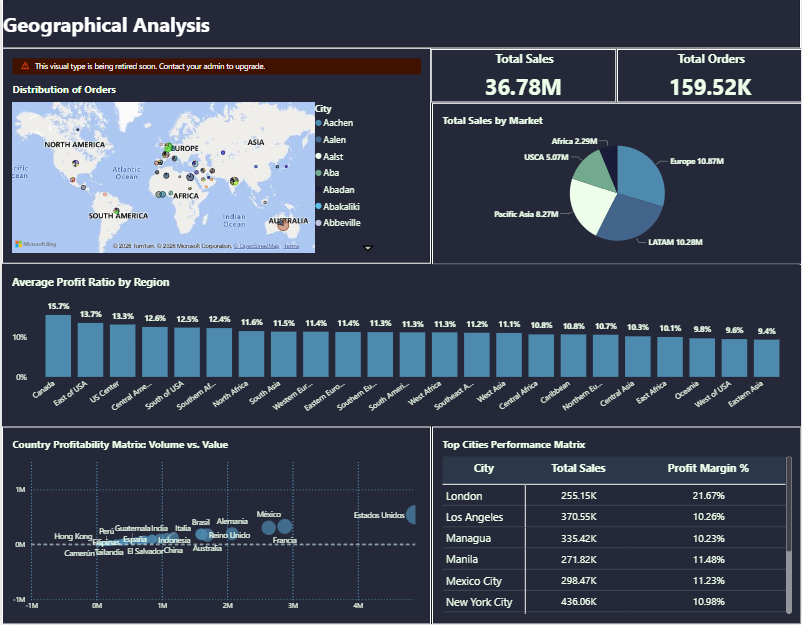
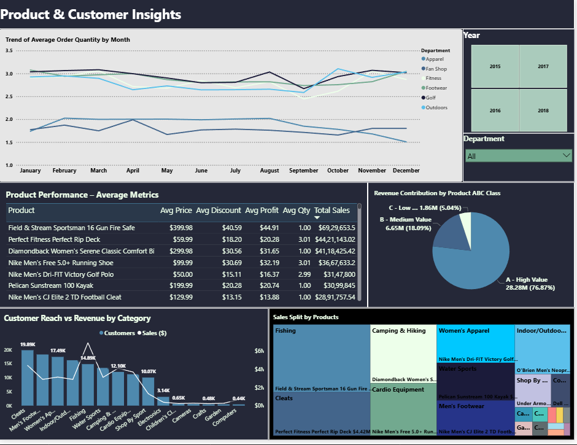
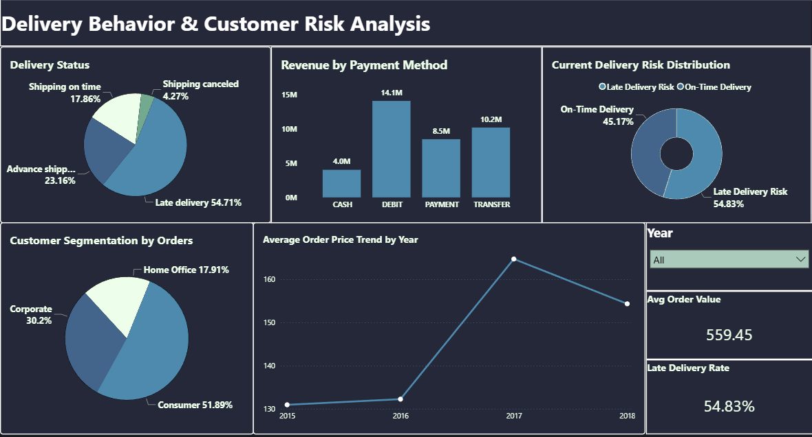
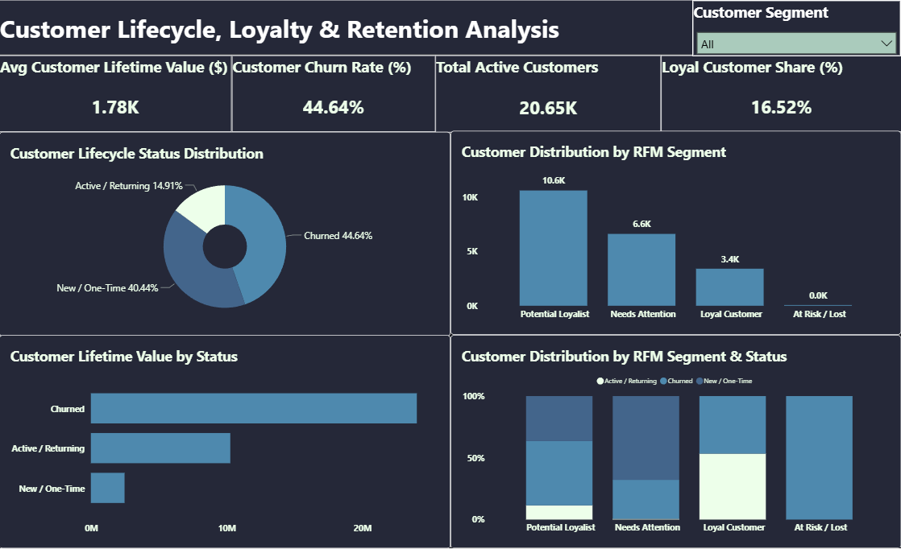

# Supply Chain Sales Analytics
**End-to-End Analytics Engineering & Business Intelligence Project**

An end-to-end **Supply Chain Sales Analytics** project demonstrating real-world **analytics engineering, data warehousing, and BI reporting** using **PostgreSQL and Power BI**.

This project follows **industry-grade BI architecture**: staged ingestion, dimensional modeling, partitioned fact tables, optimized reporting views, and dashboard-driven insights.

---

## 🚀 Project Highlights

- Designed a scalable **star-schema data warehouse**
- Built **partitioned fact tables** for large-scale analytics
- Implemented staged **ETL pipelines using pure SQL**
- Clearly separated **warehouse logic from reporting logic**
- Optimized performance using **indexes and materialized views**
- Delivered **production-ready Power BI dashboards**
- Performed **customer lifecycle, RFM, and ABC analysis**

---

## 🎯 Business Objectives

- Enable analytics-ready reporting for supply chain data
- Analyze sales performance, delivery behavior, and customer retention
- Identify high-value customers and high-impact products
- Reduce dashboard load time using pre-aggregated views
- Support business decision-making through KPI-driven insights

---

## 📦 Dataset Overview

The dataset represents **order-item–level supply chain transactions**, including:

- Orders and order items
- Customer demographics and behavior
- Products, categories, and departments
- Shipping modes, delivery timelines, and fulfillment metrics
- Sales, profit, and quantity measures

> Raw data is ingested as text and progressively refined through typed staging, warehouse modeling, and reporting views.

---

## 🏗️ Architecture Overview

```text
staging.dataco_raw        (raw ingestion – all text)
        ↓
staging.dataco_clean      (typed & cleaned staging)
        ↓
warehouse schema
├── dim_date
├── dim_customer
├── dim_product
└── fact_order_items      (partitioned by order year)
        ↓
reports schema
├── Reporting Views (per dashboard page)
└── Materialized Views (RFM, ABC)
        ↓
Power BI Dashboards
```

This layered architecture mirrors modern analytics engineering workflows used in production BI systems.

---

## 🧱 Data Model (Star Schema)

### Fact Table
**`warehouse.fact_order_items`**
- **Grain:** One row per order item
- **Partitioning:** By order year
- **Measures:** Sales, profit, quantity, shipping duration, delivery delay indicators

### Dimension Tables
- **`dim_date`** – Calendar attributes (year, month, week, weekday/weekend)
- **`dim_customer`** – Customer demographics and behavioral attributes
- **`dim_product`** – Product, category, and department hierarchy

This design enables high-performance joins and BI-friendly consumption.

---

## 🔄 ETL & Data Processing Phases

### Phase 1 — Raw Staging
- Ingest raw CSV into `staging.dataco_raw`
- All columns stored as `TEXT`
- Initial data profiling and validation

### Phase 2 — Cleaned Staging
- Safe type casting (numeric, date, timestamp)
- Parsing order and shipping timestamps
- Stored in `staging.dataco_clean`

### Phase 3 — Warehouse Modeling
- Star schema creation
- Surrogate keys for dimensions
- Fact table partitioned by year

### Phase 4 — Data Loading
- Dimension population
- Fact loading with surrogate key mapping
- Referential integrity checks

### Phase 5 — Performance Optimization
- Foreign key and filter indexes
- Composite indexes for BI queries
- Materialized views for heavy aggregations

---

## 📊 Reporting & Analytics Layer

All dashboards consume data exclusively from the `reports` schema.

### Reporting SQL Files

| SQL File | Dashboard Purpose |
| :--- | :--- |
| `01_sales_dashboard.sql` | Sales Overview |
| `02_geographical_dashboard.sql` | Geographical Analysis |
| `03_product_customer_dashboard.sql` | Product & Customer Insights |
| `04_delivery_behavior_dashboard.sql` | Delivery Behavior |
| `05_customer_analytics.sql` | Customer Lifecycle & Retention |
| `06_materialized_views.sql` | RFM & ABC Optimizations |

*Each SQL file has a clear purpose header, defines a single reporting contract, and is safe to re-run (DROP + CREATE pattern).*

---

## 📈 Advanced Analytics Implemented

### Customer Lifecycle & Retention
- New vs Returning vs Churned customers
- Customer lifetime behavior tracking
- Retention and churn risk indicators

### RFM Analysis (Materialized View)
- Recency, Frequency, Monetary scoring
- **Customer segmentation:**
  - Loyal Customers
  - Potential Loyalists
  - Needs Attention
  - At Risk / Lost

### Product ABC Analysis
- Revenue-based product classification:
  - **A:** High-value products
  - **B:** Medium-value products
  - **C:** Low-value products

*Materialized views significantly reduce Power BI query load time.*

---

## 📊 Power BI Dashboards

The Power BI report is built entirely on SQL reporting views.

### Dashboard Pages
- Sales Overview
- Geographical Analysis
- Product & Customer Insights
- Delivery Behavior
- Customer Lifecycle & Retention

---

## 🖼️ Dashboard Previews

### Sales Overview Dashboard

<br>

### Geographical Analysis Dashboard

<br>

### Product & Customer Analysis Dashboard

<br>

### Delivery Behavior Dashboard

<br>

### Customer Lifecycle Dashboard

<br>

---

## 📁 Repository Structure

```text
Supply-Chain-Sales-Analytics/
│
├── powerbi/
│   └── Supply_Chain_Sales_Analytics.pbix
│
├── screenshots/
│   └── dashboard previews (.png)
│
├── sql/
│   ├── staging/
│   │   └── 01_staging_raw_and_clean.sql
│   │
│   ├── warehouse/
│   │   ├── 01_dimensions.sql
│   │   ├── 02_fact_order_items_partitioned.sql
│   │   └── 03_fact_order_items_indexes.sql
│   │
│   └── reports/
│       ├── 01_sales_dashboard.sql
│       ├── 02_geographical_dashboard.sql
│       ├── 03_product_customer_dashboard.sql
│       ├── 04_delivery_behavior_dashboard.sql
│       ├── 05_customer_analytics.sql
│       └── 06_materialized_views.sql
│
├── .gitignore
└── README.md
```

---

## 🛠️ Tools & Technologies

- PostgreSQL
- SQL (Analytics Engineering)
- Power BI
- Data Warehousing
- Star Schema Modeling
- Table Partitioning & Indexing
- Git & GitHub

---

## 👤 Author

**Mayuresh Ahire**
Data Analyst | Analytics Engineering | Business Intelligence

- **GitHub:** [mayuresh0711](https://github.com/mayuresh0711)
- **LinkedIn:** [Mayuresh Ahire](https://www.linkedin.com/in/mayuresh-ahire-ab079b2a3)